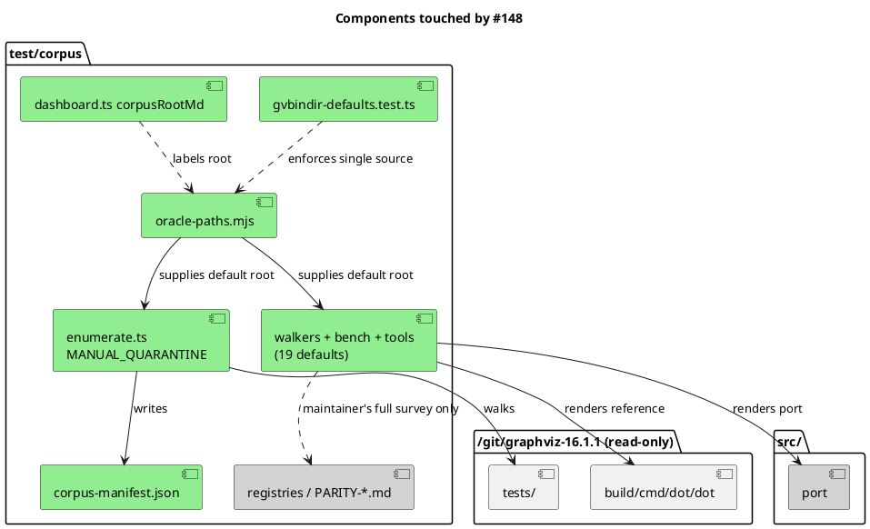

# Component map: what #148 touches

```plantuml
@startuml
title Components touched by #148
package "test/corpus" {
  [oracle-paths.mjs] as OP #lightgreen
  [gvbindir-defaults.test.ts] as FT #lightgreen
  [enumerate.ts\nMANUAL_QUARANTINE] as EN #lightgreen
  [corpus-manifest.json] as MF #lightgreen
  [walkers + bench + tools\n(19 defaults)] as WK #lightgreen
  [dashboard.ts corpusRootMd] as DB #lightgreen
  [registries / PARITY-*.md] as REG #lightgray
}
package "src/" {
  [port] as PORT #lightgray
}
package "~/git/graphviz-16.1.1 (read-only)" {
  [tests/] as T
  [build/cmd/dot/dot] as DOT
}
OP --> WK : supplies default root
OP --> EN : supplies default root
FT ..> OP : enforces single source
EN --> MF : writes
EN --> T : walks
WK --> DOT : renders reference
WK --> PORT : renders port
WK ..> REG : maintainer's full survey only
DB ..> OP : labels root
@enduml
```

Green: changed. Grey: unchanged by this mission.
