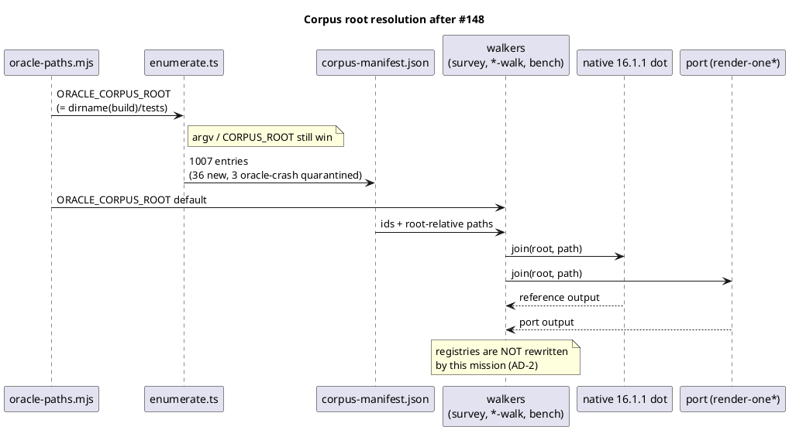

# Data flow: how the corpus root reaches the walkers (after T1)

```plantuml
@startuml
title Corpus root resolution after #148
participant "oracle-paths.mjs" as OP
participant "enumerate.ts" as EN
participant "corpus-manifest.json" as MF
participant "walkers\n(survey, *-walk, bench)" as WK
participant "native 16.1.1 dot" as NAT
participant "port (render-one*)" as PORT

OP -> EN : ORACLE_CORPUS_ROOT\n(= dirname(build)/tests)
note right of EN : argv / CORPUS_ROOT still win
EN -> MF : 1007 entries\n(36 new, 3 oracle-crash quarantined)
OP -> WK : ORACLE_CORPUS_ROOT default
MF -> WK : ids + root-relative paths
WK -> NAT : join(root, path)
WK -> PORT : join(root, path)
NAT --> WK : reference output
PORT --> WK : port output
note over WK : registries are NOT rewritten\nby this mission (AD-2)
@enduml
```
