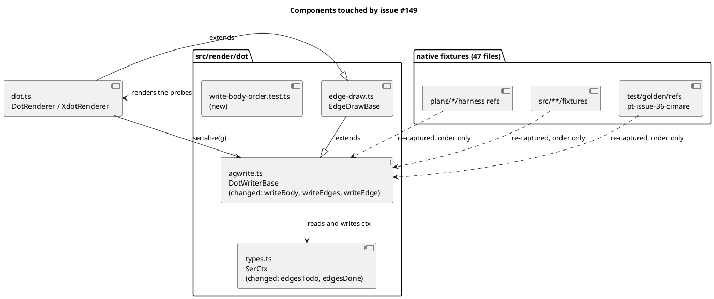

# Component map

```plantuml
@startuml
title Components touched by issue #149
package "src/render/dot" {
  [agwrite.ts\nDotWriterBase\n(changed: writeBody, writeEdges, writeEdge)] as W
  [types.ts\nSerCtx\n(changed: edgesTodo, edgesDone)] as T
  [edge-draw.ts\nEdgeDrawBase] as ED
  [write-body-order.test.ts\n(new)] as P
}
[dot.ts\nDotRenderer / XdotRenderer] as R
package "native fixtures (47 files)" {
  [plans/*/harness refs] as H
  [src/**/__fixtures__] as F
  [test/golden/refs\npt-issue-36-cimare] as G
}
ED --|> W : extends
R --|> ED : extends
R --> W : serialize(g)
W --> T : reads and writes ctx
P ..> R : renders the probes
H ..> W : re-captured, order only
F ..> W : re-captured, order only
G ..> W : re-captured, order only
@enduml
```

Only `-Tdot` and `-Txdot` reach `serialize`, on every engine. `svg`, `json`,
`plain`, `imap` and `cmapx` have their own writers, so they cannot change.
