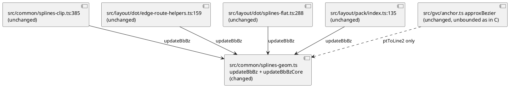

# Component map

```plantuml
@startuml
component "src/common/splines-geom.ts\nupdateBbBz + updateBbBzCore\n(changed)" as geom
component "src/common/splines-clip.ts:385\n(unchanged)" as clip
component "src/layout/dot/edge-route-helpers.ts:159\n(unchanged)" as erh
component "src/layout/dot/splines-flat.ts:288\n(unchanged)" as flat
component "src/layout/pack/index.ts:135\n(unchanged)" as pack
component "src/gvc/anchor.ts approxBezier\n(unchanged, unbounded as in C)" as anchor
clip --> geom : updateBbBz
erh --> geom : updateBbBz
flat --> geom : updateBbBz
pack --> geom : updateBbBz
anchor ..> geom : ptToLine2 only
@enduml
```
