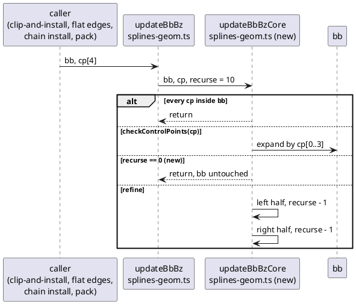

# Data flow: bounding one Bézier segment

```plantuml
@startuml
participant "caller\n(clip-and-install, flat edges,\nchain install, pack)" as caller
participant "updateBbBz\nsplines-geom.ts" as wrap
participant "updateBbBzCore\nsplines-geom.ts (new)" as core
participant "bb" as bb

caller -> wrap : bb, cp[4]
wrap -> core : bb, cp, recurse = 10
alt every cp inside bb
  core --> wrap : return
else checkControlPoints(cp)
  core -> bb : expand by cp[0..3]
else recurse == 0 (new)
  core --> wrap : return, bb untouched
else refine
  core -> core : left half, recurse - 1
  core -> core : right half, recurse - 1
end
@enduml
```
