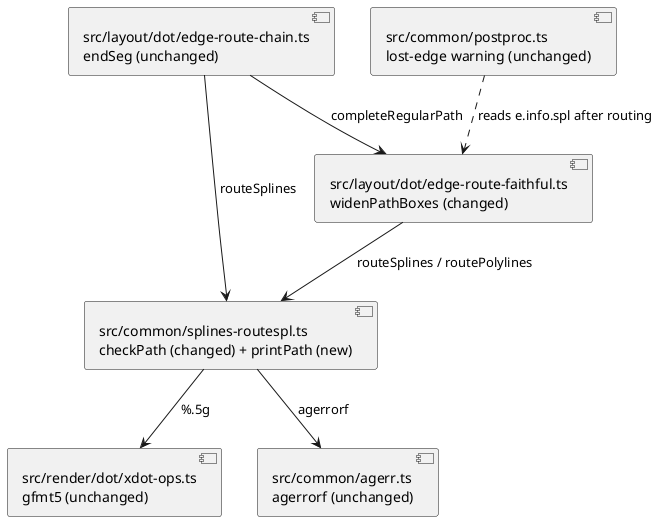

# Component map

```plantuml
@startuml
component "src/layout/dot/edge-route-faithful.ts\nwidenPathBoxes (changed)" as faithful
component "src/layout/dot/edge-route-chain.ts\nendSeg (unchanged)" as chain
component "src/common/splines-routespl.ts\ncheckPath (changed) + printPath (new)" as routespl
component "src/render/dot/xdot-ops.ts\ngfmt5 (unchanged)" as gfmt
component "src/common/agerr.ts\nagerrorf (unchanged)" as agerr
component "src/common/postproc.ts\nlost-edge warning (unchanged)" as post
chain --> faithful : completeRegularPath
faithful --> routespl : routeSplines / routePolylines
chain --> routespl : routeSplines
routespl --> gfmt : %.5g
routespl --> agerr : agerrorf
post ..> faithful : reads e.info.spl after routing
@enduml
```
