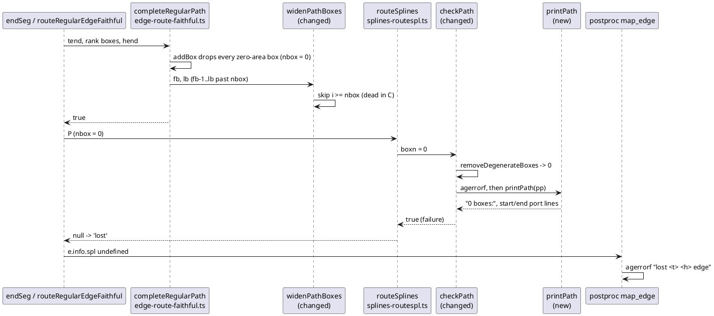

# Data flow: an edge whose boxes all drop

```plantuml
@startuml
participant "endSeg / routeRegularEdgeFaithful" as caller
participant "completeRegularPath\nedge-route-faithful.ts" as crp
participant "widenPathBoxes\n(changed)" as widen
participant "routeSplines\nsplines-routespl.ts" as rs
participant "checkPath\n(changed)" as cp
participant "printPath\n(new)" as pp
participant "postproc map_edge" as post

caller -> crp : tend, rank boxes, hend
crp -> crp : addBox drops every zero-area box (nbox = 0)
crp -> widen : fb, lb (fb-1..lb past nbox)
widen -> widen : skip i >= nbox (dead in C)
crp --> caller : true
caller -> rs : P (nbox = 0)
rs -> cp : boxn = 0
cp -> cp : removeDegenerateBoxes -> 0
cp -> pp : agerrorf, then printPath(pp)
pp --> cp : "0 boxes:", start/end port lines
cp --> rs : true (failure)
rs --> caller : null -> 'lost'
caller -> post : e.info.spl undefined
post -> post : agerrorf "lost <t> <h> edge"
@enduml
```
