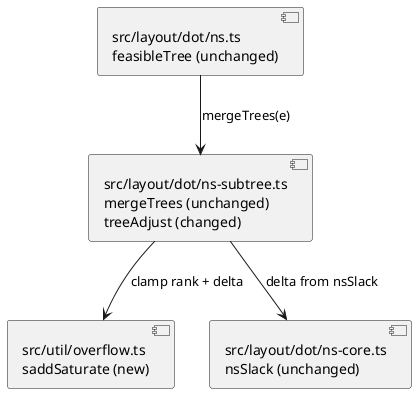

# Component map

```plantuml
@startuml
component "src/layout/dot/ns.ts\nfeasibleTree (unchanged)" as ns
component "src/layout/dot/ns-subtree.ts\nmergeTrees (unchanged)\ntreeAdjust (changed)" as sub
component "src/util/overflow.ts\nsaddSaturate (new)" as ovf
component "src/layout/dot/ns-core.ts\nnsSlack (unchanged)" as core
ns --> sub : mergeTrees(e)
sub --> core : delta from nsSlack
sub --> ovf : clamp rank + delta
@enduml
```
