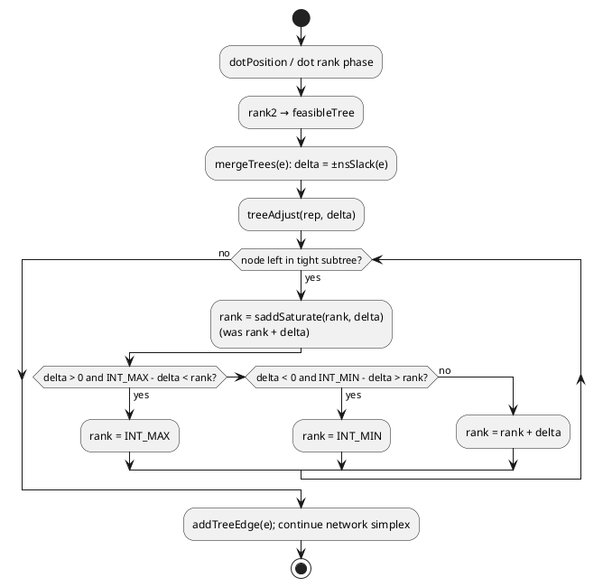

# Data flow: where the clamp sits

```plantuml
@startuml
start
:dotPosition / dot rank phase;
:rank2 → feasibleTree;
:mergeTrees(e): delta = ±nsSlack(e);
:treeAdjust(rep, delta);
while (node left in tight subtree?) is (yes)
  :rank = saddSaturate(rank, delta)\n(was rank + delta);
  if (delta > 0 and INT_MAX - delta < rank?) then (yes)
    :rank = INT_MAX;
  elseif (delta < 0 and INT_MIN - delta > rank?) then (yes)
    :rank = INT_MIN;
  else (no)
    :rank = rank + delta;
  endif
endwhile (no)
:addTreeEdge(e); continue network simplex;
stop
@enduml
```

Native 16.1.1 on `1314` and `2758` never gets here in `dot_position`:
`make_aux_edge` fails first (#162). The port has no #162 yet, so it does.
