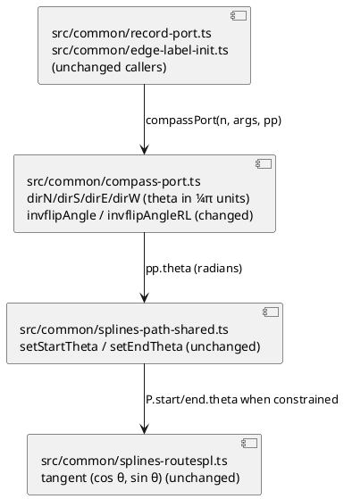

# Component map

```plantuml
@startuml
component "src/common/compass-port.ts\ndirN/dirS/dirE/dirW (theta in ¼π units)\ninvflipAngle / invflipAngleRL (changed)" as cp
component "src/common/record-port.ts\nsrc/common/edge-label-init.ts\n(unchanged callers)" as callers
component "src/common/splines-path-shared.ts\nsetStartTheta / setEndTheta (unchanged)" as path
component "src/common/splines-routespl.ts\ntangent (cos θ, sin θ) (unchanged)" as route
callers --> cp : compassPort(n, args, pp)
cp --> path : pp.theta (radians)
path --> route : P.start/end.theta when constrained
@enduml
```
