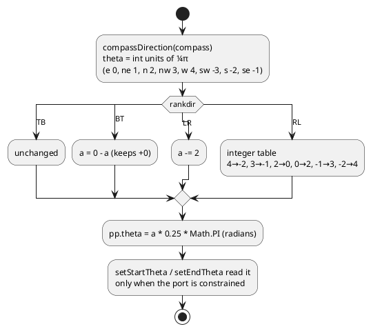

# Data flow: theta through compassPort

```plantuml
@startuml
start
:compassDirection(compass)\ntheta = int units of ¼π\n(e 0, ne 1, n 2, nw 3, w 4, sw -3, s -2, se -1);
switch (rankdir)
case (TB)
  :unchanged;
case (BT)
  :a = 0 - a (keeps +0);
case (LR)
  :a -= 2;
case (RL)
  :integer table\n4→-2, 3→-1, 2→0, 0→2, -1→3, -2→4;
endswitch
:pp.theta = a * 0.25 * Math.PI (radians);
:setStartTheta / setEndTheta read it\nonly when the port is constrained;
stop
@enduml
```
