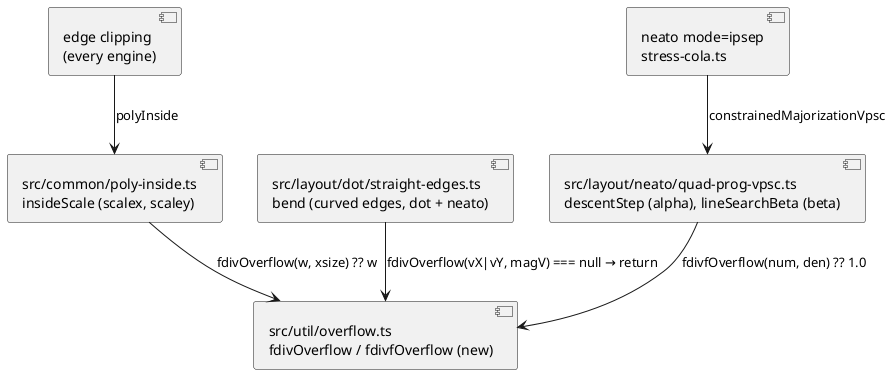

# Component map

```plantuml
@startuml
component "src/util/overflow.ts\nfdivOverflow / fdivfOverflow (new)" as ov
component "src/common/poly-inside.ts\ninsideScale (scalex, scaley)" as pi
component "src/layout/dot/straight-edges.ts\nbend (curved edges, dot + neato)" as se
component "src/layout/neato/quad-prog-vpsc.ts\ndescentStep (alpha), lineSearchBeta (beta)" as qp
component "edge clipping\n(every engine)" as clip
component "neato mode=ipsep\nstress-cola.ts" as cola
pi --> ov : fdivOverflow(w, xsize) ?? w
se --> ov : fdivOverflow(vX|vY, magV) === null → return
qp --> ov : fdivfOverflow(num, den) ?? 1.0
clip --> pi : polyInside
cola --> qp : constrainedMajorizationVpsc
@enduml
```
