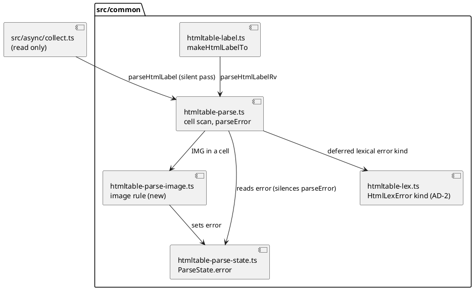

# Components touched

```plantuml
@startuml
package "src/common" {
  [htmltable-label.ts\nmakeHtmlLabelTo] as L
  [htmltable-parse.ts\ncell scan, parseError] as P
  [htmltable-parse-image.ts\nimage rule (new)] as I
  [htmltable-parse-state.ts\nParseState.error] as S
  [htmltable-lex.ts\nHtmlLexError kind (AD-2)] as X
}
[src/async/collect.ts\n(read only)] as C
L --> P : parseHtmlLabelRv
P --> I : IMG in a cell
I --> S : sets error
P --> S : reads error (silences parseError)
P --> X : deferred lexical error kind
C --> P : parseHtmlLabel (silent pass)
@enduml
```
