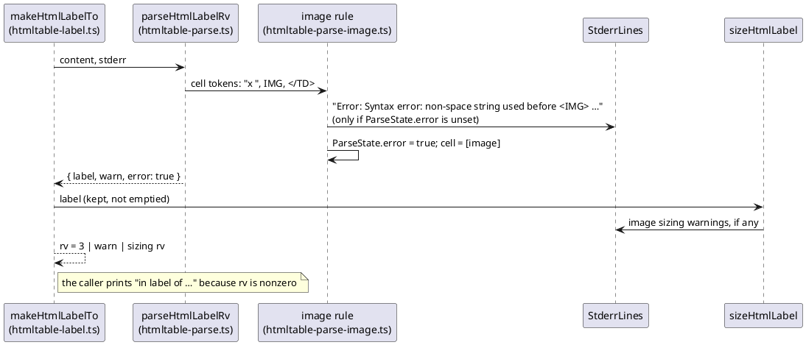

# Data flow: a cell `<TD>x </TD>` on 16.1.1

```plantuml
@startuml
participant "makeHtmlLabelTo\n(htmltable-label.ts)" as L
participant "parseHtmlLabelRv\n(htmltable-parse.ts)" as P
participant "image rule\n(htmltable-parse-image.ts)" as I
participant "StderrLines" as E
participant "sizeHtmlLabel" as S
L -> P : content, stderr
P -> I : cell tokens: "x ", IMG, </TD>
I -> E : "Error: Syntax error: non-space string used before <IMG> …"\n(only if ParseState.error is unset)
I -> I : ParseState.error = true; cell = [image]
P --> L : { label, warn, error: true }
L -> S : label (kept, not emptied)
S -> E : image sizing warnings, if any
L --> L : rv = 3 | warn | sizing rv
note right of L : the caller prints "in label of …" because rv is nonzero
@enduml
```
