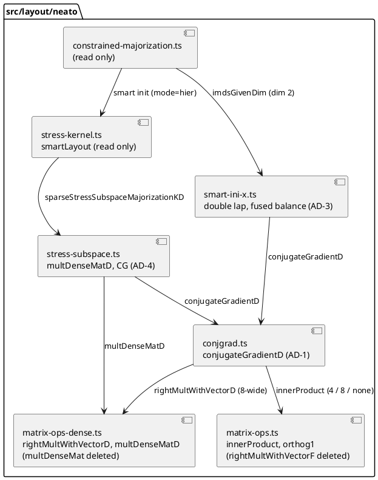

# Components touched

```plantuml
@startuml
package "src/layout/neato" {
  [constrained-majorization.ts\n(read only)] as CM
  [stress-kernel.ts\nsmartLayout (read only)] as SK
  [stress-subspace.ts\nmultDenseMatD, CG (AD-4)] as SS
  [smart-ini-x.ts\ndouble lap, fused balance (AD-3)] as IX
  [conjgrad.ts\nconjugateGradientD (AD-1)] as CG
  [matrix-ops-dense.ts\nrightMultWithVectorD, multDenseMatD\n(multDenseMat deleted)] as MD
  [matrix-ops.ts\ninnerProduct, orthog1\n(rightMultWithVectorF deleted)] as MO
}
CM --> SK : smart init (mode=hier)
SK --> SS : sparseStressSubspaceMajorizationKD
CM --> IX : imdsGivenDim (dim 2)
SS --> MD : multDenseMatD
SS --> CG : conjugateGradientD
IX --> CG : conjugateGradientD
CG --> MD : rightMultWithVectorD (8-wide)
CG --> MO : innerProduct (4 / 8 / none)
@enduml
```
