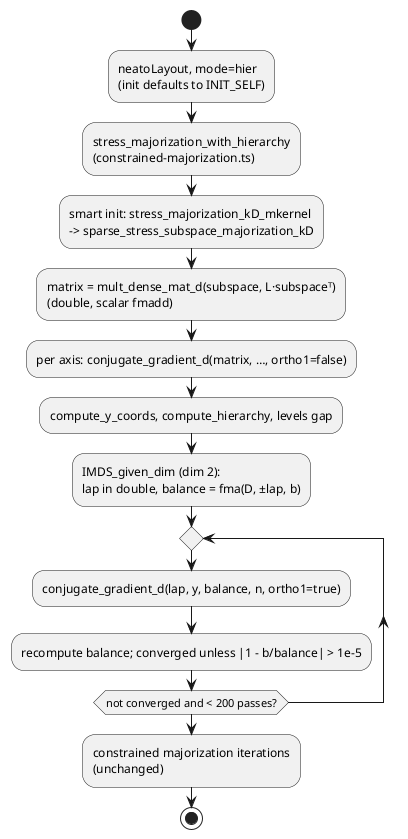

# `mode=hier`, from start to end, after the mission

```plantuml
@startuml
start
:neatoLayout, mode=hier\n(init defaults to INIT_SELF);
:stress_majorization_with_hierarchy\n(constrained-majorization.ts);
:smart init: stress_majorization_kD_mkernel\n-> sparse_stress_subspace_majorization_kD;
:matrix = mult_dense_mat_d(subspace, L·subspaceᵀ)\n(double, scalar fmadd);
:per axis: conjugate_gradient_d(matrix, …, ortho1=false);
:compute_y_coords, compute_hierarchy, levels gap;
:IMDS_given_dim (dim 2):\nlap in double, balance = fma(D, ±lap, b);
repeat
  :conjugate_gradient_d(lap, y, balance, n, ortho1=true);
  :recompute balance; converged unless |1 - b/balance| > 1e-5;
repeat while (not converged and < 200 passes?)
:constrained majorization iterations\n(unchanged);
stop
@enduml
```
