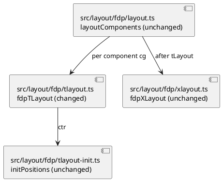

# Component map

```plantuml
@startuml
component "src/layout/fdp/layout.ts\nlayoutComponents (unchanged)" as lay
component "src/layout/fdp/tlayout.ts\nfdpTLayout (changed)" as tl
component "src/layout/fdp/tlayout-init.ts\ninitPositions (unchanged)" as init
component "src/layout/fdp/xlayout.ts\nfdpXLayout (unchanged)" as xl
lay --> tl : per component cg
tl --> init : ctr
lay --> xl : after tLayout
@enduml
```
