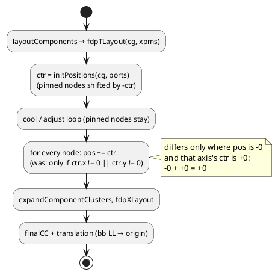

# Data flow: where ctr is added back

```plantuml
@startuml
start
:layoutComponents → fdpTLayout(cg, xpms);
:ctr = initPositions(cg, ports)\n(pinned nodes shifted by -ctr);
:cool / adjust loop (pinned nodes stay);
:for every node: pos += ctr\n(was: only if ctr.x != 0 || ctr.y != 0);
note right
  differs only where pos is -0
  and that axis's ctr is +0:
  -0 + +0 = +0
end note
:expandComponentClusters, fdpXLayout;
:finalCC + translation (bb LL → origin);
stop
@enduml
```

The final translation adds a non-zero offset to every coordinate, so the sign of
a zero never reaches an output format.
