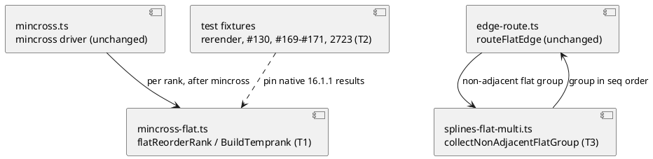

# Component map

```plantuml
@startuml
component "mincross.ts\nmincross driver (unchanged)" as mc
component "mincross-flat.ts\nflatReorderRank / BuildTemprank (T1)" as fr
component "edge-route.ts\nrouteFlatEdge (unchanged)" as er
component "splines-flat-multi.ts\ncollectNonAdjacentFlatGroup (T3)" as grp
component "test fixtures\nrerender, #130, #169-#171, 2723 (T2)" as fx
mc --> fr : per rank, after mincross
er --> grp : non-adjacent flat group
grp --> er : group in seq order
fx ..> fr : pin native 16.1.1 results
@enduml
```
