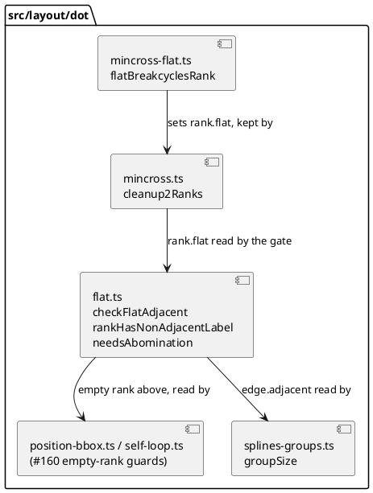

# Component map

```plantuml
@startuml
package "src/layout/dot" {
  [mincross.ts\ncleanup2Ranks] as CL
  [mincross-flat.ts\nflatBreakcyclesRank] as FB
  [flat.ts\ncheckFlatAdjacent\nrankHasNonAdjacentLabel\nneedsAbomination] as FL
  [position-bbox.ts / self-loop.ts\n(#160 empty-rank guards)] as G
  [splines-groups.ts\ngroupSize] as SG
}
FB --> CL : sets rank.flat, kept by
CL --> FL : rank.flat read by the gate
FL --> G : empty rank above, read by
FL --> SG : edge.adjacent read by
@enduml
```

Changed: `mincross.ts`, `flat.ts`. Read, unchanged: the rest.
