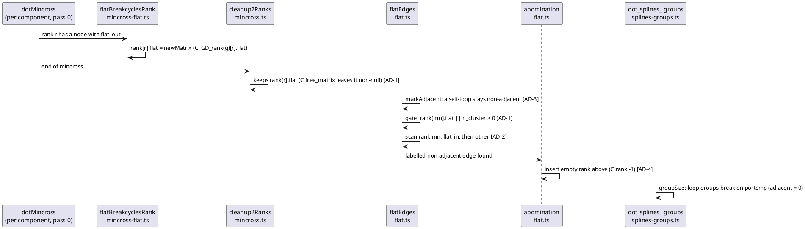

# Data flow: where the gate's matrix comes from and who reads it

```plantuml
@startuml
participant "dotMincross\n(per component, pass 0)" as MC
participant "flatBreakcyclesRank\nmincross-flat.ts" as FB
participant "cleanup2Ranks\nmincross.ts" as CL
participant "flatEdges\nflat.ts" as FE
participant "abomination\nflat.ts" as AB
participant "dot_splines_ groups\nsplines-groups.ts" as SG

MC -> FB : rank r has a node with flat_out
FB -> FB : rank[r].flat = newMatrix (C: GD_rank(g)[r].flat)
MC -> CL : end of mincross
CL -> CL : keeps rank[r].flat (C free_matrix leaves it non-null) [AD-1]
FE -> FE : markAdjacent: a self-loop stays non-adjacent [AD-3]
FE -> FE : gate: rank[mn].flat || n_cluster > 0 [AD-1]
FE -> FE : scan rank mn: flat_in, then other [AD-2]
FE -> AB : labelled non-adjacent edge found
AB -> AB : insert empty rank above (C rank -1) [AD-4]
SG -> SG : groupSize: loop groups break on portcmp (adjacent = 0)
@enduml
```
