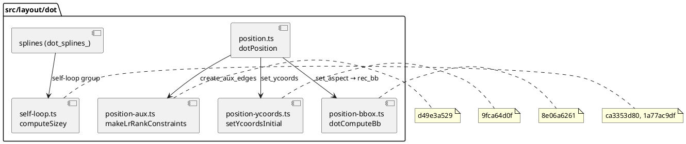

# Component map: #160's write-set

```plantuml
@startuml
package "src/layout/dot" {
  [position.ts\ndotPosition] as POS
  [position-aux.ts\nmakeLrRankConstraints] as AUX
  [position-ycoords.ts\nsetYcoordsInitial] as YC
  [position-bbox.ts\ndotComputeBb] as BB
  [self-loop.ts\ncomputeSizey] as SL
  [splines (dot_splines_)] as SPL
}
POS --> AUX : create_aux_edges
POS --> YC : set_ycoords
POS --> BB : set_aspect → rec_bb
SPL --> SL : self-loop group
note right of AUX : d49e3a529
note right of YC : 9fca64d0f
note right of BB : 8e06a6261
note right of SL : ca3353d80, 1a77ac9df
@enduml
```

Tests: each module's `*.branch.test.ts` (or `position.test.ts` for bb), plus the
new `empty-rank-2759.test.ts`.
