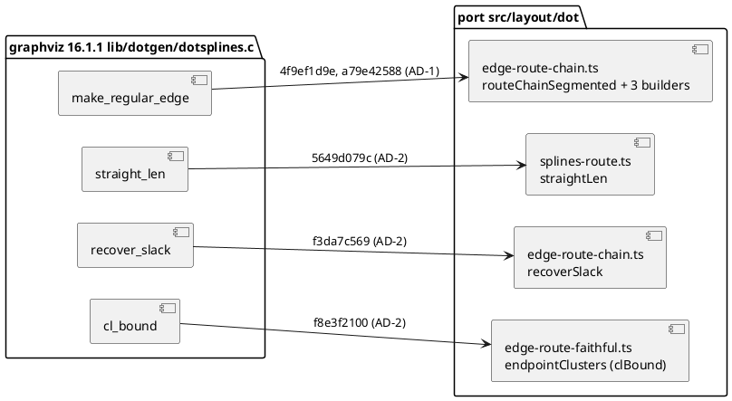

# Component map: where each 16.1.1 guard lands

```plantuml
@startuml
left to right direction
package "graphviz 16.1.1 lib/dotgen/dotsplines.c" {
  [make_regular_edge] as MRE
  [straight_len] as SL
  [recover_slack] as RS
  [cl_bound] as CLB
}
package "port src/layout/dot" {
  [edge-route-chain.ts\nrouteChainSegmented + 3 builders] as RCS
  [edge-route-chain.ts\nrecoverSlack] as PRS
  [splines-route.ts\nstraightLen] as PSL
  [edge-route-faithful.ts\nendpointClusters (clBound)] as PCL
}
MRE --> RCS : 4f9ef1d9e, a79e42588 (AD-1)
RS --> PRS : f3da7c569 (AD-2)
SL --> PSL : 5649d079c (AD-2)
CLB --> PCL : f8e3f2100 (AD-2)
@enduml
```
