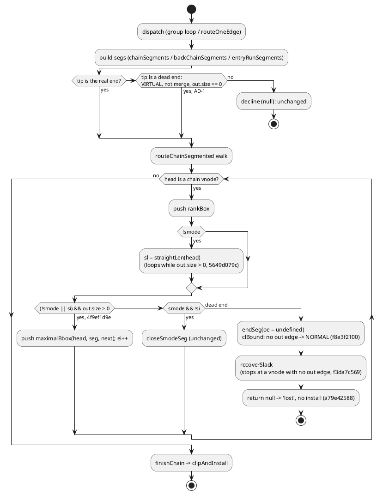

# Data flow: a chain that ends at a vnode with no out edge

As proposed (the head after T1). The base declines at "chain complete?" when
the tip is not the real end node.

```plantuml
@startuml
start
:dispatch (group loop / routeOneEdge);
:build segs (chainSegments / backChainSegments / entryRunSegments);
if (tip is the real end?) then (yes)
elseif (tip is a dead end:\nVIRTUAL, not merge, out.size == 0) then (yes, AD-1)
else (no)
  :decline (null): unchanged;
  stop
endif
:routeChainSegmented walk;
while (head is a chain vnode?) is (yes)
  :push rankBox;
  if (!smode) then (yes)
    :sl = straightLen(head)\n(loops while out.size > 0, 5649d079c);
  endif
  if ((!smode || si) && out.size > 0) then (yes, 4f9ef1d9e)
    :push maximalBbox(head, seg, next); ei++;
  elseif (smode && !si) then (yes)
    :closeSmodeSeg (unchanged);
  else (dead end)
    :endSeg(oe = undefined)\nclBound: no out edge -> NORMAL (f8e3f2100);
    :recoverSlack\n(stops at a vnode with no out edge, f3da7c569);
    :return null -> 'lost', no install (a79e42588);
    stop
  endif
endwhile (no)
:finishChain -> clipAndInstall;
stop
@enduml
```
