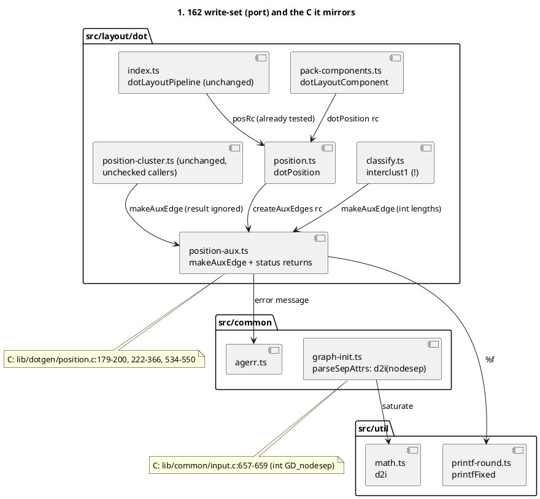

# Component map: files #162 touches

```plantuml
@startuml
title #162 write-set (port) and the C it mirrors
package "src/common" {
  [graph-init.ts\nparseSepAttrs: d2i(nodesep)] as GI
  [agerr.ts] as AE
}
package "src/util" {
  [printf-round.ts\nprintfFixed] as PF
  [math.ts\nd2i] as M
}
package "src/layout/dot" {
  [position-aux.ts\nmakeAuxEdge + status returns] as PA
  [position.ts\ndotPosition] as P
  [classify.ts\ninterclust1 (!)] as C
  [pack-components.ts\ndotLayoutComponent] as PC
  [index.ts\ndotLayoutPipeline (unchanged)] as I
  [position-cluster.ts (unchanged,\nunchecked callers)] as PCL
}
GI --> M : saturate
PA --> AE : error message
PA --> PF : %f
P --> PA : createAuxEdges rc
PC --> P : dotPosition rc
I --> P : posRc (already tested)
C --> PA : makeAuxEdge (int lengths)
PCL --> PA : makeAuxEdge (result ignored)
note bottom of PA
  C: lib/dotgen/position.c:179-200, 222-366, 534-550
end note
note bottom of GI
  C: lib/common/input.c:657-659 (int GD_nodesep)
end note
@enduml
```
