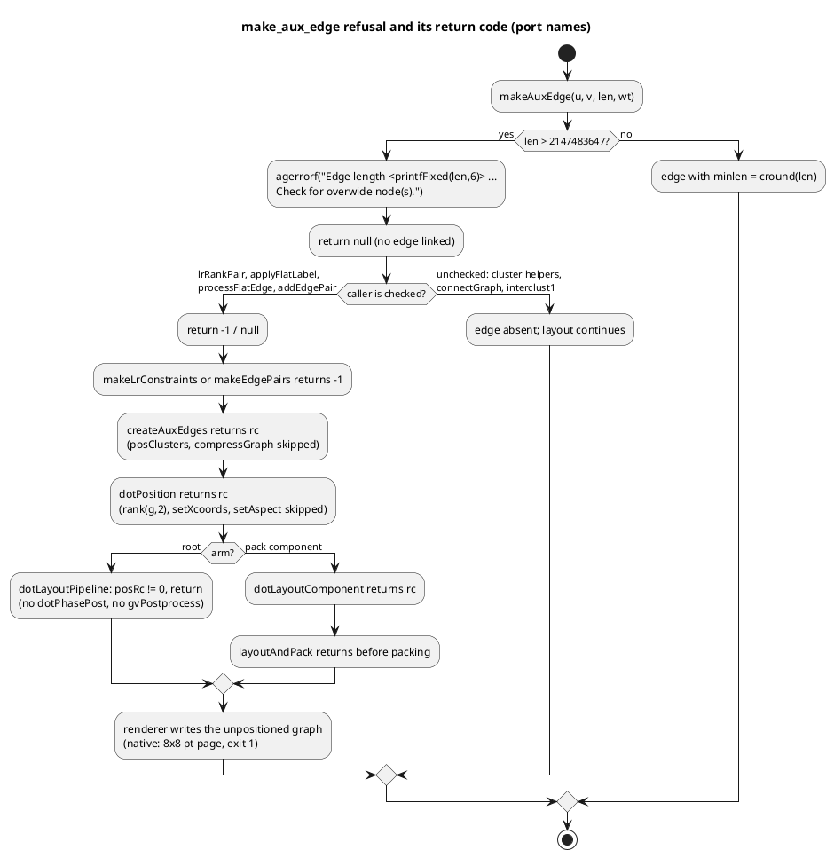

# Data flow: an aux edge longer than INT_MAX (16.1.1, as planned)

```plantuml
@startuml
title make_aux_edge refusal and its return code (port names)
start
:makeAuxEdge(u, v, len, wt);
if (len > 2147483647?) then (yes)
  :agerrorf("Edge length <printfFixed(len,6)> ...\nCheck for overwide node(s).");
  :return null (no edge linked);
  if (caller is checked?) then (lrRankPair, applyFlatLabel,\nprocessFlatEdge, addEdgePair)
    :return -1 / null;
    :makeLrConstraints or makeEdgePairs returns -1;
    :createAuxEdges returns rc\n(posClusters, compressGraph skipped);
    :dotPosition returns rc\n(rank(g,2), setXcoords, setAspect skipped);
    if (arm?) then (root)
      :dotLayoutPipeline: posRc != 0, return\n(no dotPhasePost, no gvPostprocess);
    else (pack component)
      :dotLayoutComponent returns rc;
      :layoutAndPack returns before packing;
    endif
    :renderer writes the unpositioned graph\n(native: 8x8 pt page, exit 1);
  else (unchecked: cluster helpers,\nconnectGraph, interclust1)
    :edge absent; layout continues;
  endif
else (no)
  :edge with minlen = cround(len);
endif
stop
@enduml
```
