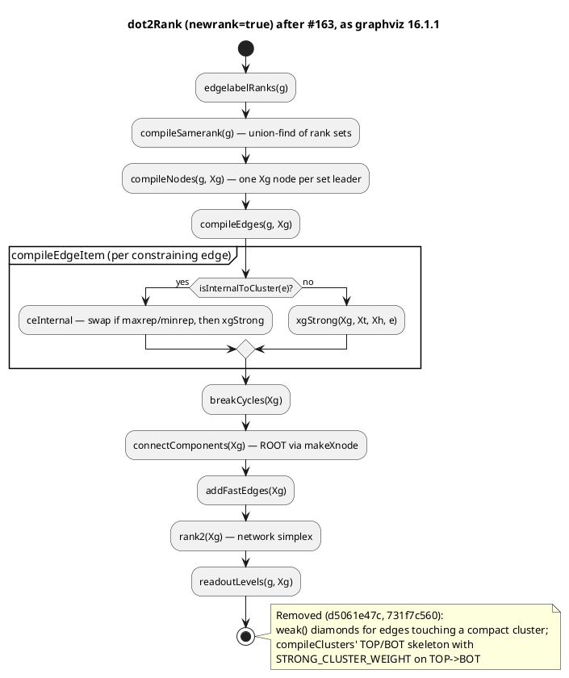

# Data flow: `dot2Rank` before and after #163

The proposed flow (16.1.1, after T1). The removed steps are listed in the note.

```plantuml
@startuml
title dot2Rank (newrank=true) after #163, as graphviz 16.1.1
start
:edgelabelRanks(g);
:compileSamerank(g) — union-find of rank sets;
:compileNodes(g, Xg) — one Xg node per set leader;
:compileEdges(g, Xg);
partition "compileEdgeItem (per constraining edge)" {
  if (isInternalToCluster(e)?) then (yes)
    :ceInternal — swap if maxrep/minrep, then xgStrong;
  else (no)
    :xgStrong(Xg, Xt, Xh, e);
  endif
}
:breakCycles(Xg);
:connectComponents(Xg) — ROOT via makeXnode;
:addFastEdges(Xg);
:rank2(Xg) — network simplex;
:readoutLevels(g, Xg);
stop
note right
  Removed (d5061e47c, 731f7c560):
  weak() diamonds for edges touching a compact cluster;
  compileClusters' TOP/BOT skeleton with
  STRONG_CLUSTER_WEIGHT on TOP->BOT
end note
@enduml
```
