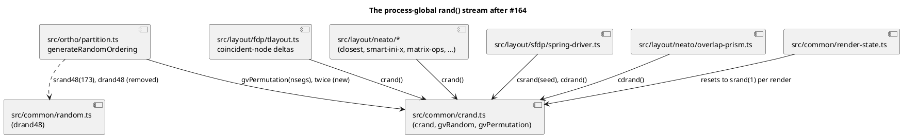

# Component map: who shares the rand() stream

```plantuml
@startuml
title The process-global rand() stream after #164
component "src/common/crand.ts\n(crand, gvRandom, gvPermutation)" as crand
component "src/common/render-state.ts" as rs
component "src/ortho/partition.ts\ngenerateRandomOrdering" as part
component "src/layout/fdp/tlayout.ts\ncoincident-node deltas" as fdp
component "src/layout/neato/*\n(closest, smart-ini-x, matrix-ops, ...)" as neato
component "src/layout/sfdp/spring-driver.ts" as sfdp
component "src/layout/neato/overlap-prism.ts" as prism
component "src/common/random.ts\n(drand48)" as d48
rs --> crand : resets to srand(1) per render
part --> crand : gvPermutation(nsegs), twice (new)
fdp --> crand : crand()
neato --> crand : crand()
sfdp --> crand : csrand(seed), cdrand()
prism --> crand : cdrand()
part ..> d48 : srand48(173), drand48 (removed)
@enduml
```
