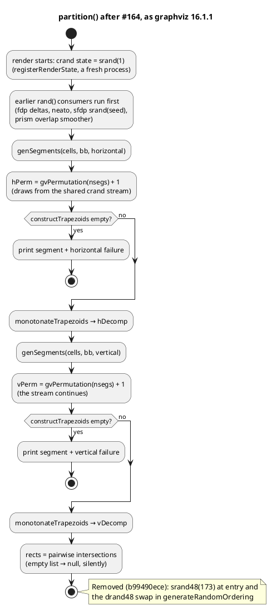

# Data flow: ortho `partition` after #164

The proposed flow (16.1.1, after T1).

```plantuml
@startuml
title partition() after #164, as graphviz 16.1.1
start
:render starts: crand state = srand(1)
(registerRenderState, a fresh process);
:earlier rand() consumers run first
(fdp deltas, neato, sfdp srand(seed),
prism overlap smoother);
:genSegments(cells, bb, horizontal);
:hPerm = gvPermutation(nsegs) + 1
(draws from the shared crand stream);
if (constructTrapezoids empty?) then (yes)
  :print segment + horizontal failure;
  stop
else (no)
endif
:monotonateTrapezoids → hDecomp;
:genSegments(cells, bb, vertical);
:vPerm = gvPermutation(nsegs) + 1
(the stream continues);
if (constructTrapezoids empty?) then (yes)
  :print segment + vertical failure;
  stop
else (no)
endif
:monotonateTrapezoids → vDecomp;
:rects = pairwise intersections
(empty list → null, silently);
stop
note right
  Removed (b99490ece): srand48(173) at entry and
  the drand48 swap in generateRandomOrdering
end note
@enduml
```
