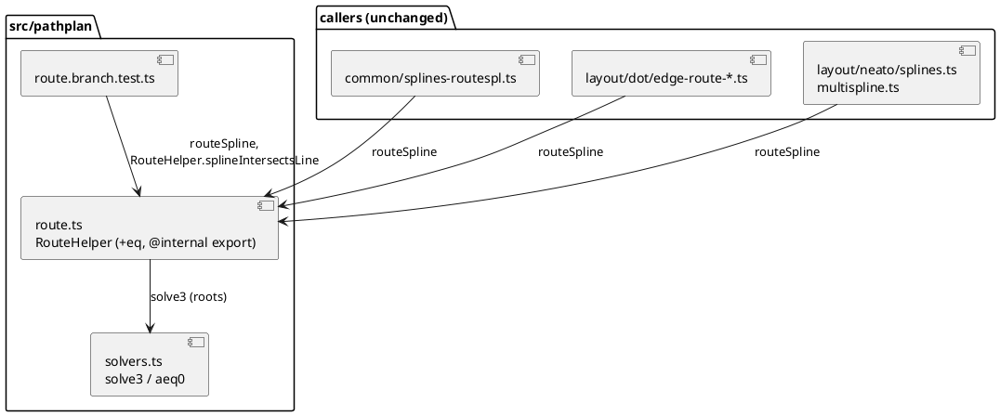

# Component map

```plantuml
@startuml
package "src/pathplan" {
  [route.ts\nRouteHelper (+eq, @internal export)] as R
  [solvers.ts\nsolve3 / aeq0] as S
  [route.branch.test.ts] as T
}
package "callers (unchanged)" {
  [common/splines-routespl.ts] as D
  [layout/dot/edge-route-*.ts] as DD
  [layout/neato/splines.ts\nmultispline.ts] as N
}
D --> R : routeSpline
DD --> R : routeSpline
N --> R : routeSpline
R --> S : solve3 (roots)
T --> R : routeSpline,\nRouteHelper.splineIntersectsLine
@enduml
```
