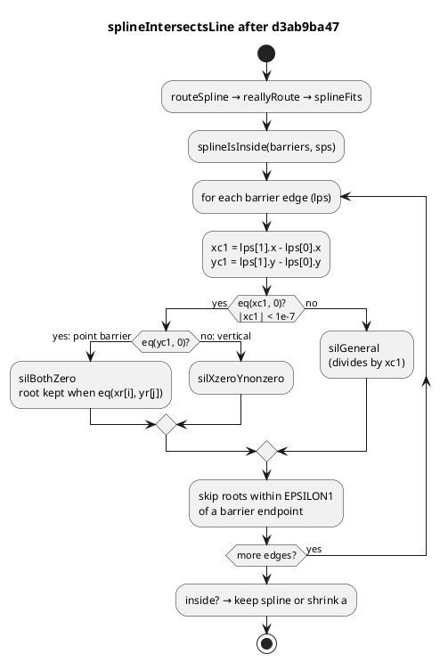

# Data flow: where the tolerance acts

```plantuml
@startuml
title splineIntersectsLine after d3ab9ba47
start
:routeSpline → reallyRoute → splineFits;
:splineIsInside(barriers, sps);
repeat :for each barrier edge (lps);
  :xc1 = lps[1].x - lps[0].x\nyc1 = lps[1].y - lps[0].y;
  if (eq(xc1, 0)?\n|xc1| < 1e-7) then (yes)
    if (eq(yc1, 0)?) then (yes: point barrier)
      :silBothZero\nroot kept when eq(xr[i], yr[j]);
    else (no: vertical)
      :silXzeroYnonzero;
    endif
  else (no)
    :silGeneral\n(divides by xc1);
  endif
  :skip roots within EPSILON1\nof a barrier endpoint;
repeat while (more edges?) is (yes)
:inside? → keep spline or shrink a;
stop
@enduml
```
