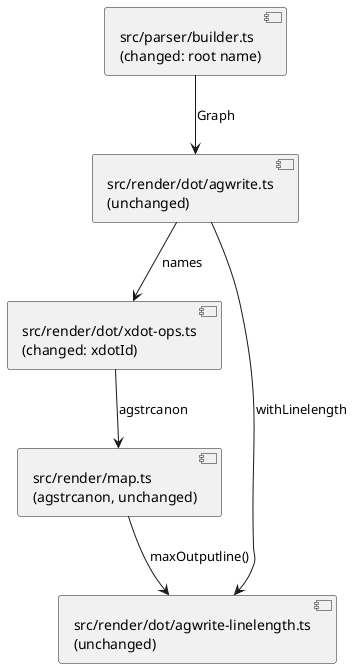

# Component map

```plantuml
@startuml
component "src/parser/builder.ts\n(changed: root name)" as B
component "src/render/dot/xdot-ops.ts\n(changed: xdotId)" as X
component "src/render/map.ts\n(agstrcanon, unchanged)" as M
component "src/render/dot/agwrite.ts\n(unchanged)" as W
component "src/render/dot/agwrite-linelength.ts\n(unchanged)" as L
B --> W : Graph
W --> X : names
X --> M : agstrcanon
M --> L : maxOutputline()
W --> L : withLinelength
@enduml
```
