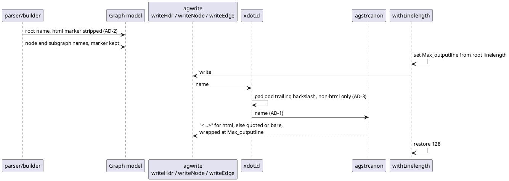

# Data flow: a name from source text to dot/xdot output

```plantuml
@startuml
participant "parser/builder" as P
participant "Graph model" as M
participant "agwrite\nwriteHdr / writeNode / writeEdge" as W
participant "xdotId" as X
participant "agstrcanon" as C
participant "withLinelength" as L

P -> M : root name, html marker stripped (AD-2)
P -> M : node and subgraph names, marker kept
L -> L : set Max_outputline from root linelength
L -> W : write
W -> X : name
X -> X : pad odd trailing backslash, non-html only (AD-3)
X -> C : name (AD-1)
C --> W : "<...>" for html, else quoted or bare,\nwrapped at Max_outputline
L -> L : restore 128
@enduml
```
