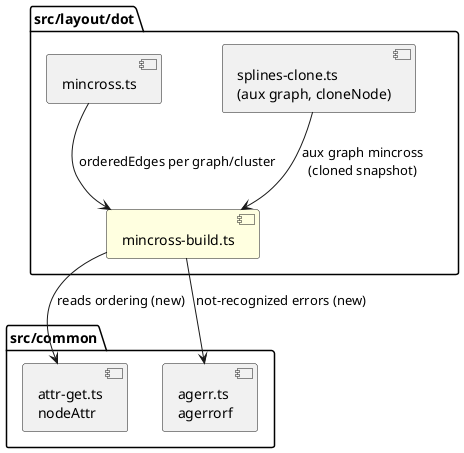

# Component map: issue #169

```plantuml
@startuml
package "src/layout/dot" {
  [mincross-build.ts] as mb #lightyellow
  [splines-clone.ts\n(aux graph, cloneNode)] as sc
  [mincross.ts] as mc
}
package "src/common" {
  [attr-get.ts\nnodeAttr] as ag
  [agerr.ts\nagerrorf] as er
}
mc --> mb : orderedEdges per graph/cluster
sc --> mb : aux graph mincross\n(cloned snapshot)
mb --> ag : reads ordering (new)
mb --> er : not-recognized errors (new)
@enduml
```

Highlighted: the only changed source file.
