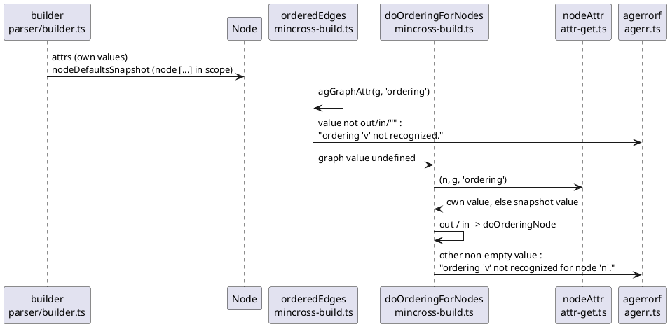

# Data flow: where a node's `ordering` is read

Proposed (after T1).

```plantuml
@startuml
participant "builder\nparser/builder.ts" as b
participant "Node" as n
participant "orderedEdges\nmincross-build.ts" as oe
participant "doOrderingForNodes\nmincross-build.ts" as dn
participant "nodeAttr\nattr-get.ts" as na
participant "agerrorf\nagerr.ts" as err

b -> n : attrs (own values)\nnodeDefaultsSnapshot (node [...] in scope)
oe -> oe : agGraphAttr(g, 'ordering')
oe -> err : value not out/in/"" :\n"ordering 'v' not recognized."
oe -> dn : graph value undefined
dn -> na : (n, g, 'ordering')
na --> dn : own value, else snapshot value
dn -> dn : out / in -> doOrderingNode
dn -> err : other non-empty value :\n"ordering 'v' not recognized for node 'n'."
@enduml
```
