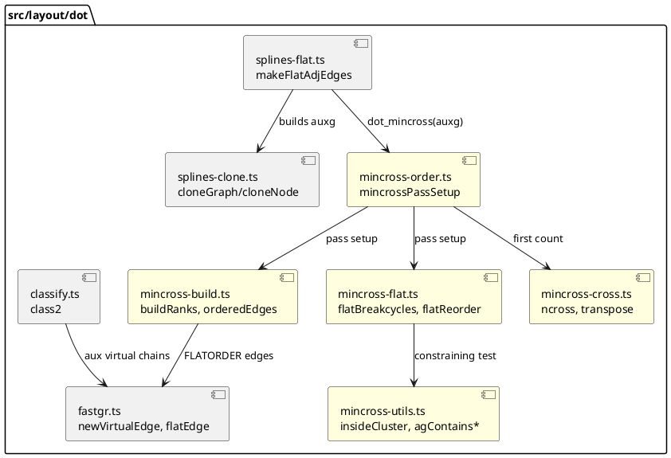

# Component map: issue #170

The candidate components. T1 picks the one that holds the origin, and only that
one changes.

```plantuml
@startuml
package "src/layout/dot" {
  [splines-flat.ts\nmakeFlatAdjEdges] as sf
  [splines-clone.ts\ncloneGraph/cloneNode] as sc
  [mincross-order.ts\nmincrossPassSetup] as mo #lightyellow
  [mincross-build.ts\nbuildRanks, orderedEdges] as mb #lightyellow
  [mincross-flat.ts\nflatBreakcycles, flatReorder] as mf #lightyellow
  [mincross-cross.ts\nncross, transpose] as mx #lightyellow
  [mincross-utils.ts\ninsideCluster, agContains*] as mu #lightyellow
  [fastgr.ts\nnewVirtualEdge, flatEdge] as fg
  [classify.ts\nclass2] as cl
}
sf --> sc : builds auxg
sf --> mo : dot_mincross(auxg)
mo --> mb : pass setup
mo --> mf : pass setup
mo --> mx : first count
mf --> mu : constraining test
mb --> fg : FLATORDER edges
cl --> fg : aux virtual chains
@enduml
```

Highlighted: the steps inside the first-count window.
