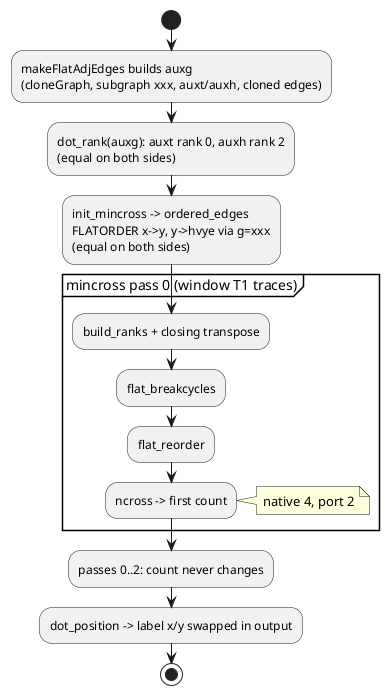

# Data flow: issue #170

Where the first divergent value comes from: the aux graph's mincross, pass 0, up
to the first crossing count. Native counts 4 there and the port counts 2.

```plantuml
@startuml
start
:makeFlatAdjEdges builds auxg\n(cloneGraph, subgraph xxx, auxt/auxh, cloned edges);
:dot_rank(auxg): auxt rank 0, auxh rank 2\n(equal on both sides);
:init_mincross -> ordered_edges\nFLATORDER x->y, y->hvye via g=xxx\n(equal on both sides);
partition "mincross pass 0 (window T1 traces)" {
  :build_ranks + closing transpose;
  :flat_breakcycles;
  :flat_reorder;
  :ncross -> first count;
}
note right: native 4, port 2
:passes 0..2: count never changes;
:dot_position -> label x/y swapped in output;
stop
@enduml
```
