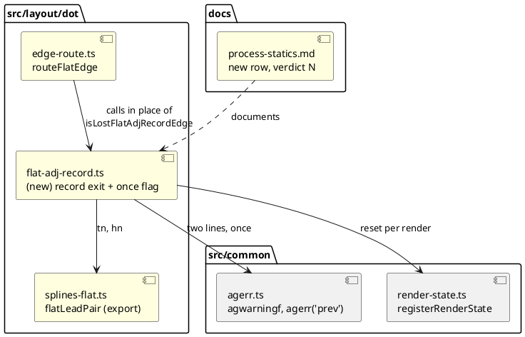

# Component map: issue #171

Modules T1 touches (highlighted) and what they use.

```plantuml
@startuml
package "src/layout/dot" {
  [edge-route.ts\nrouteFlatEdge] as er #lightyellow
  [flat-adj-record.ts\n(new) record exit + once flag] as fr #lightyellow
  [splines-flat.ts\nflatLeadPair (export)] as sf #lightyellow
}
package "src/common" {
  [agerr.ts\nagwarningf, agerr('prev')] as ag
  [render-state.ts\nregisterRenderState] as rs
}
package docs {
  [process-statics.md\nnew row, verdict N] as ps #lightyellow
}
er --> fr : calls in place of\nisLostFlatAdjRecordEdge
fr --> sf : tn, hn
fr --> ag : two lines, once
fr --> rs : reset per render
ps ..> fr : documents
@enduml
```
