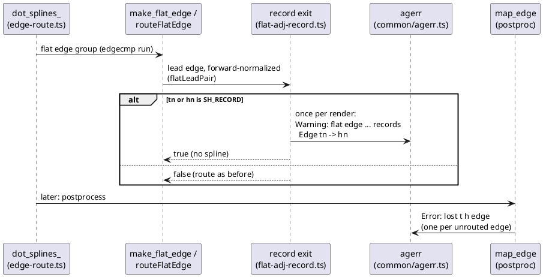

# Data flow: issue #171

Where the warning is written: C, and the port after T1.

```plantuml
@startuml
participant "dot_splines_\n(edge-route.ts)" as ds
participant "make_flat_edge /\nrouteFlatEdge" as fe
participant "record exit\n(flat-adj-record.ts)" as rx
participant "agerr\n(common/agerr.ts)" as ag
participant "map_edge\n(postproc)" as me

ds -> fe : flat edge group (edgecmp run)
fe -> rx : lead edge, forward-normalized\n(flatLeadPair)
alt tn or hn is SH_RECORD
  rx -> ag : once per render:\nWarning: flat edge ... records\n  Edge tn -> hn
  rx --> fe : true (no spline)
else
  rx --> fe : false (route as before)
end
ds -> me : later: postprocess
me -> ag : Error: lost t h edge\n(one per unrouted edge)
@enduml
```
