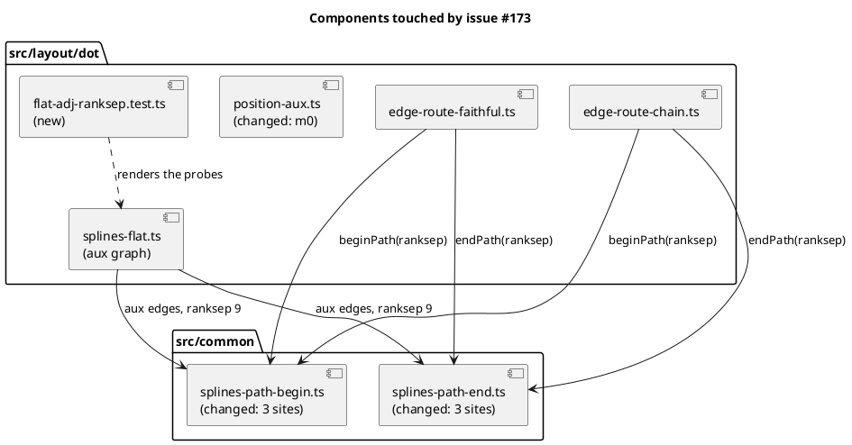

# Component map

```plantuml
@startuml
title Components touched by issue #173
package "src/common" {
  [splines-path-begin.ts\n(changed: 3 sites)] as B
  [splines-path-end.ts\n(changed: 3 sites)] as E
}
package "src/layout/dot" {
  [edge-route-faithful.ts] as F
  [edge-route-chain.ts] as C
  [splines-flat.ts\n(aux graph)] as SF
  [position-aux.ts\n(changed: m0)] as P
  [flat-adj-ranksep.test.ts\n(new)] as T
}
F --> B : beginPath(ranksep)
F --> E : endPath(ranksep)
C --> B : beginPath(ranksep)
C --> E : endPath(ranksep)
SF --> B : aux edges, ranksep 9
SF --> E : aux edges, ranksep 9
T ..> SF : renders the probes
@enduml
```

Only `dot` calls `beginPath`/`endPath` (the callers above, plus
`src/common/splines.ts`), so no other engine's output can change.
