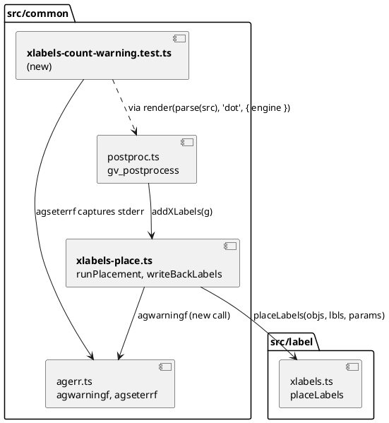

# Component map: issue #174

Modules T1 touches (bold) and the ones it only calls.

```plantuml
@startuml
package "src/common" {
  [**xlabels-place.ts**\nrunPlacement, writeBackLabels] as xp
  [**xlabels-count-warning.test.ts**\n(new)] as t
  [postproc.ts\ngv_postprocess] as pp
  [agerr.ts\nagwarningf, agseterrf] as ag
}
package "src/label" {
  [xlabels.ts\nplaceLabels] as pl
}
pp --> xp : addXLabels(g)
xp --> pl : placeLabels(objs, lbls, params)
xp --> ag : agwarningf (new call)
t --> ag : agseterrf captures stderr
t ..> pp : via render(parse(src), 'dot', { engine })
@enduml
```
