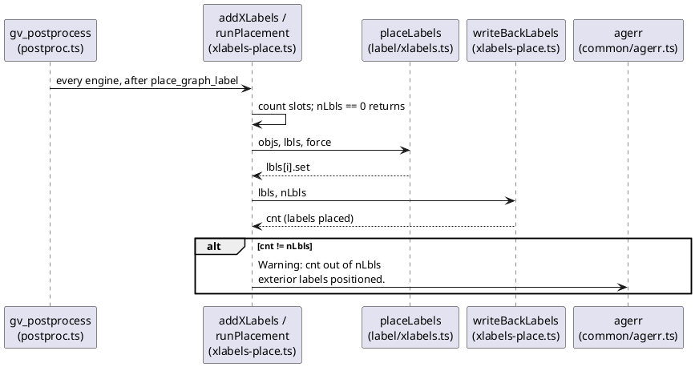

# Data flow: issue #174

Where the warning is written: C, and the port after T1.

```plantuml
@startuml
participant "gv_postprocess\n(postproc.ts)" as pp
participant "addXLabels /\nrunPlacement\n(xlabels-place.ts)" as ax
participant "placeLabels\n(label/xlabels.ts)" as pl
participant "writeBackLabels\n(xlabels-place.ts)" as wb
participant "agerr\n(common/agerr.ts)" as ag

pp -> ax : every engine, after place_graph_label
ax -> ax : count slots; nLbls == 0 returns
ax -> pl : objs, lbls, force
pl --> ax : lbls[i].set
ax -> wb : lbls, nLbls
wb --> ax : cnt (labels placed)
alt cnt != nLbls
  ax -> ag : Warning: cnt out of nLbls\nexterior labels positioned.
end
@enduml
```
