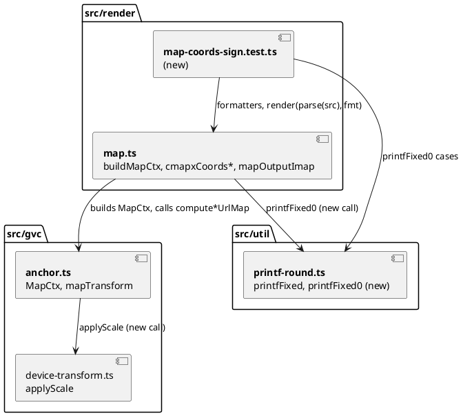

# Component map: issue #175

Modules T1 touches (bold) and the ones it only calls.

```plantuml
@startuml
package "src/render" {
  [**map.ts**\nbuildMapCtx, cmapxCoords*, mapOutputImap] as map
  [**map-coords-sign.test.ts**\n(new)] as t
}
package "src/gvc" {
  [**anchor.ts**\nMapCtx, mapTransform] as anc
  [device-transform.ts\napplyScale] as dt
}
package "src/util" {
  [**printf-round.ts**\nprintfFixed, printfFixed0 (new)] as pr
}
map --> anc : builds MapCtx, calls compute*UrlMap
anc --> dt : applyScale (new call)
map --> pr : printfFixed0 (new call)
t --> map : formatters, render(parse(src), fmt)
t --> pr : printfFixed0 cases
@enduml
```
