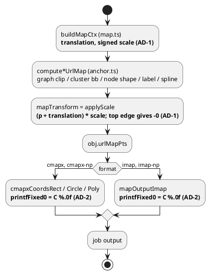

# Data flow: issue #175

Where one imagemap coordinate is computed and printed, after T1. The two
changed steps are marked.

```plantuml
@startuml
start
:buildMapCtx (map.ts)\n**translation, signed scale (AD-1)**;
:compute*UrlMap (anchor.ts)\ngraph clip / cluster bb / node shape / label / spline;
:mapTransform = applyScale\n**(p + translation) * scale; top edge gives -0 (AD-1)**;
:obj.urlMapPts;
if (format) then (cmapx, cmapx-np)
  :cmapxCoordsRect / Circle / Poly\n**printfFixed0 = C %.0f (AD-2)**;
else (imap, imap-np)
  :mapOutputImap\n**printfFixed0 = C %.0f (AD-2)**;
endif
:job output;
stop
@enduml
```
