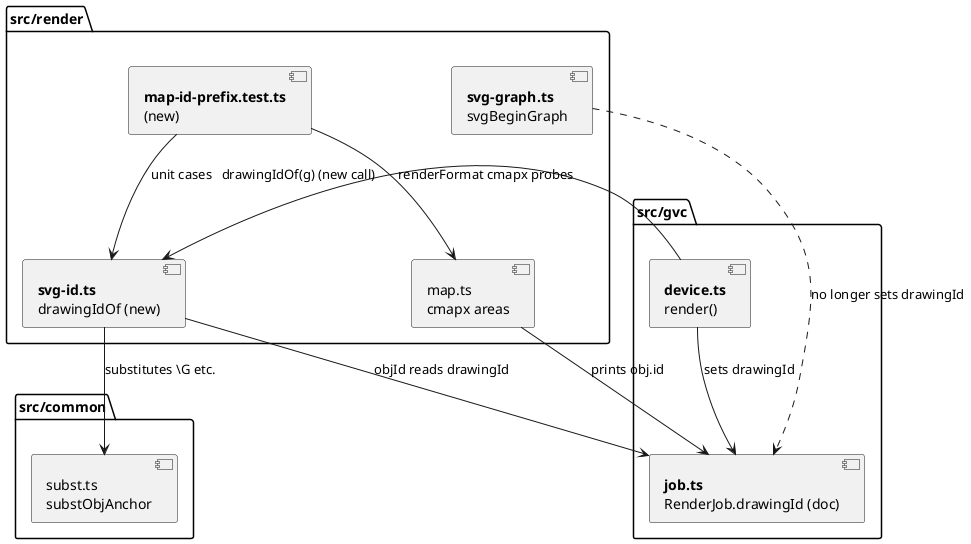

# Component map: issue #176

Modules T1 touches (bold) and the ones it only calls.

```plantuml
@startuml
package "src/gvc" {
  [**device.ts**\nrender()] as dev
  [**job.ts**\nRenderJob.drawingId (doc)] as job
}
package "src/render" {
  [**svg-id.ts**\ndrawingIdOf (new)] as sid
  [**svg-graph.ts**\nsvgBeginGraph] as sg
  [map.ts\ncmapx areas] as map
  [**map-id-prefix.test.ts**\n(new)] as t
}
package "src/common" {
  [subst.ts\nsubstObjAnchor] as sub
}
dev --> sid : drawingIdOf(g) (new call)
dev --> job : sets drawingId
sid --> sub : substitutes \\G etc.
sid --> job : objId reads drawingId
sg ..> job : no longer sets drawingId
map --> job : prints obj.id
t --> sid : unit cases
t --> map : renderFormat cmapx probes
@enduml
```
