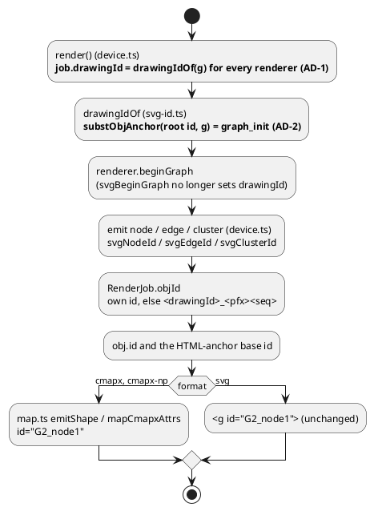

# Data flow: issue #176

Where one area id is built, after T1. The changed steps are marked.

```plantuml
@startuml
start
:render() (device.ts)\n**job.drawingId = drawingIdOf(g) for every renderer (AD-1)**;
:drawingIdOf (svg-id.ts)\n**substObjAnchor(root id, g) = graph_init (AD-2)**;
:renderer.beginGraph\n(svgBeginGraph no longer sets drawingId);
:emit node / edge / cluster (device.ts)\nsvgNodeId / svgEdgeId / svgClusterId;
:RenderJob.objId\nown id, else <drawingId>_<pfx><seq>;
:obj.id and the HTML-anchor base id;
if (format) then (cmapx, cmapx-np)
  :map.ts emitShape / mapCmapxAttrs\nid="G2_node1";
else (svg)
  :<g id="G2_node1"> (unchanged);
endif
stop
@enduml
```
