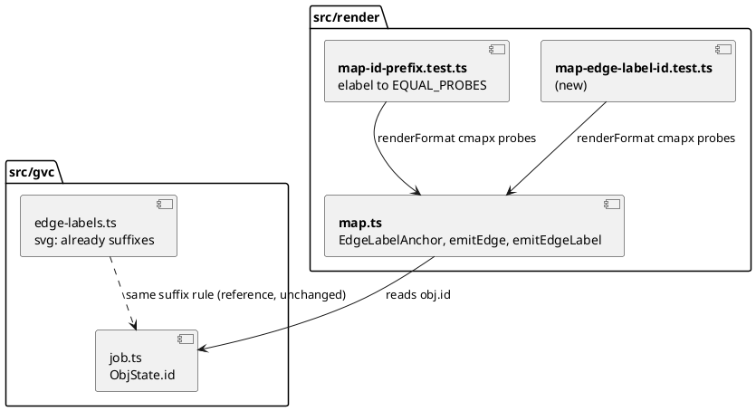

# Component map: issue #177

Modules T1 touches (bold) and the ones it only reads.

```plantuml
@startuml
package "src/render" {
  [**map.ts**\nEdgeLabelAnchor, emitEdge, emitEdgeLabel] as map
  [**map-edge-label-id.test.ts**\n(new)] as t
  [**map-id-prefix.test.ts**\nelabel to EQUAL_PROBES] as t176
}
package "src/gvc" {
  [edge-labels.ts\nsvg: already suffixes] as el
  [job.ts\nObjState.id] as job
}
map --> job : reads obj.id
t --> map : renderFormat cmapx probes
t176 --> map : renderFormat cmapx probes
el ..> job : same suffix rule (reference, unchanged)
@enduml
```
