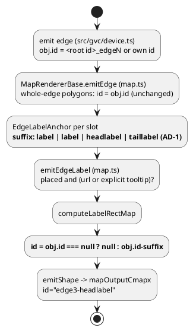

# Data flow: issue #177

Where an edge-label area id is built, after T1. The changed steps are bold.

```plantuml
@startuml
start
:emit edge (src/gvc/device.ts)\nobj.id = <root id>_edgeN or own id;
:MapRendererBase.emitEdge (map.ts)\nwhole-edge polygons: id = obj.id (unchanged);
:EdgeLabelAnchor per slot\n**suffix: label | label | headlabel | taillabel (AD-1)**;
:emitEdgeLabel (map.ts)\nplaced and (url or explicit tooltip)?;
:computeLabelRectMap;
:**id = obj.id === null ? null : obj.id-suffix**;
:emitShape -> mapOutputCmapx\nid="edge3-headlabel";
stop
@enduml
```
