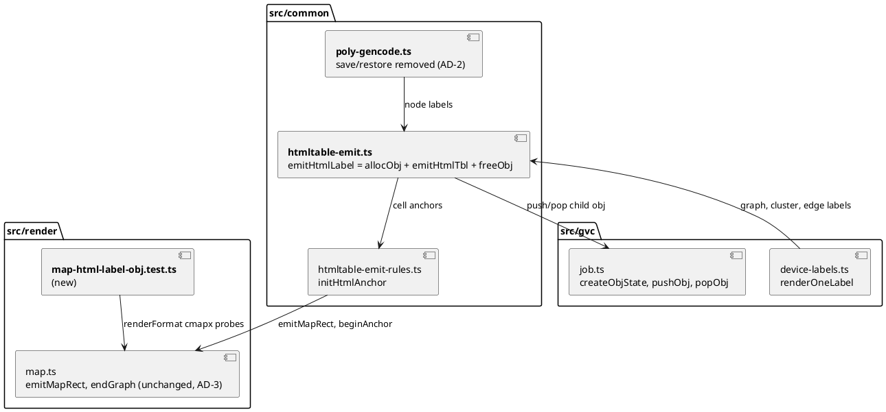

# Component map: issue #178

The modules T1 touches (bold) and the ones it only reads.

```plantuml
@startuml
package "src/common" {
  [**htmltable-emit.ts**\nemitHtmlLabel = allocObj + emitHtmlTbl + freeObj] as hte
  [**poly-gencode.ts**\nsave/restore removed (AD-2)] as pg
  [htmltable-emit-rules.ts\ninitHtmlAnchor] as rules
}
package "src/gvc" {
  [job.ts\ncreateObjState, pushObj, popObj] as job
  [device-labels.ts\nrenderOneLabel] as dl
}
package "src/render" {
  [map.ts\nemitMapRect, endGraph (unchanged, AD-3)] as map
  [**map-html-label-obj.test.ts**\n(new)] as t
}
dl --> hte : graph, cluster, edge labels
pg --> hte : node labels
hte --> job : push/pop child obj
hte --> rules : cell anchors
rules --> map : emitMapRect, beginAnchor
t --> map : renderFormat cmapx probes
@enduml
```
