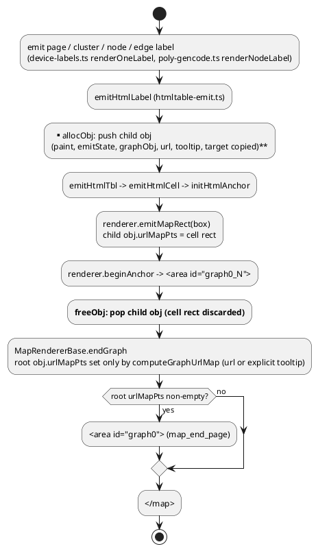

# Data flow: issue #178

How an anchored HTML cell reaches the map output after T1. The changed steps
are in bold.

```plantuml
@startuml
start
:emit page / cluster / node / edge label\n(device-labels.ts renderOneLabel, poly-gencode.ts renderNodeLabel);
:emitHtmlLabel (htmltable-emit.ts);
:**allocObj: push child obj\n(paint, emitState, graphObj, url, tooltip, target copied)**;
:emitHtmlTbl -> emitHtmlCell -> initHtmlAnchor;
:renderer.emitMapRect(box)\nchild obj.urlMapPts = cell rect;
:renderer.beginAnchor -> <area id="graph0_N">;
:**freeObj: pop child obj (cell rect discarded)**;
:MapRendererBase.endGraph\nroot obj.urlMapPts set only by computeGraphUrlMap (url or explicit tooltip);
if (root urlMapPts non-empty?) then (yes)
  :<area id="graph0"> (map_end_page);
else (no)
endif
:</map>;
stop
@enduml
```
